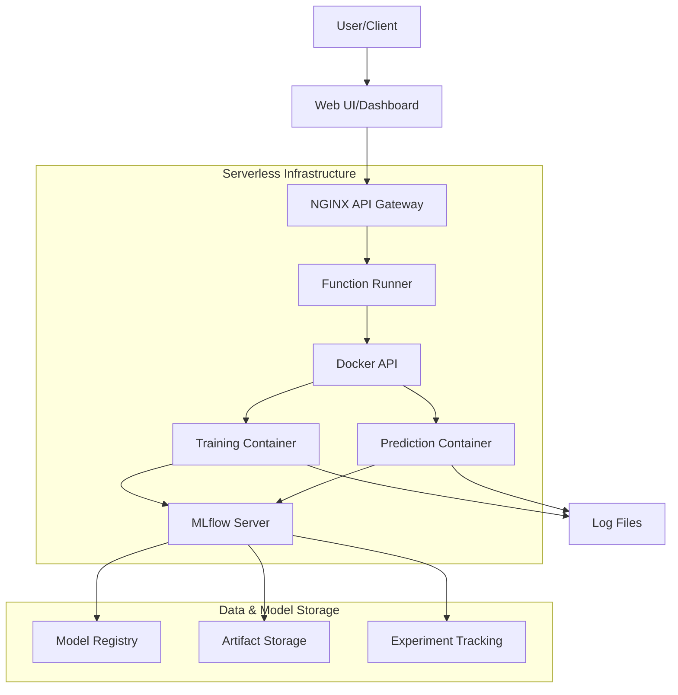

# Serverless MLOps Template

A production-ready serverless MLOps architecture using Docker containers for on-demand execution of ML training and prediction functions, with MLflow for experiment tracking and model versioning.

## Architecture Overview

This project implements a lightweight, containerized serverless MLOps architecture that enables efficient training, tracking, and deployment of machine learning models.



## Key Components

### Function Runner (API Server)

The function runner is a Flask application that:
- Receives requests to execute ML functions via REST API
- Dynamically builds Docker images for ML functions if needed
- Creates containers to run the functions with proper isolation
- Returns results and manages container lifecycle
- Provides endpoints to interact with MLflow

### ML Functions

The system includes containerized ML functions:

- **Train**: 
  - Trains a Random Forest model on the Iris dataset
  - Logs parameters, metrics, and artifacts to MLflow
  - Registers the trained model in the MLflow registry
  - Supports hyperparameter tuning

- **Predict**: 
  - Makes predictions using a trained model from the registry
  - Loads models from MLflow by name and version
  - Handles input validation and preprocessing
  - Returns formatted prediction results

### MLflow Integration

MLflow provides comprehensive ML lifecycle management:
- **Experiment Tracking**: Log parameters, metrics, and artifacts
- **Model Registry**: Version control for ML models
- **Model Serving**: Load models for inference
- **Artifact Storage**: Store model files and metadata

### NGINX API Gateway

NGINX serves as:
- API gateway routing requests to appropriate services
- Static file server for the web UI
- Reverse proxy for MLflow UI

## Getting Started

### Prerequisites

- Docker and Docker Compose
- Git
- At least 4GB of available RAM

### Installation and Setup

1. **Clone the repository**:
   ```bash
   git clone https://github.com/yourusername/serverless-mlops-template.git
   cd serverless-mlops-template
   ```

2. **Start the services**:
   ```bash
   ./start.sh
   ```
   This script will:
   - Start all services with Docker Compose
   - Ensure proper initialization sequence
   - Verify that all services are running correctly

3. **Access the Web UI**:
   - Open http://localhost in your browser
   - The dashboard provides interfaces for training and prediction

4. **Access MLflow UI**:
   - Open http://localhost/mlflow in your browser
   - View experiments, model versions, and metrics

### Manual Startup (Alternative)

If you prefer to start services manually:

```bash
# Start all services
docker-compose up -d

# Wait for services to initialize
sleep 20

# Check service status
docker-compose ps
```

## Usage Guide

### Training a Model

#### Via Web UI
1. Navigate to http://localhost
2. Set hyperparameters:
   - Number of estimators (default: 100)
   - Max depth (default: None)
   - Test size (default: 0.2)
3. Click "Train Model"
4. View results including:
   - Accuracy, precision, recall, F1 score
   - Training time
   - Model URI in MLflow

#### Via API
```bash
curl -X POST http://localhost/invoke \
  -H "Content-Type: application/json" \
  -d '{
    "function": "train",
    "parameters": {
      "n_estimators": 100,
      "max_depth": 10,
      "test_size": 0.2
    }
  }'
```

### Making Predictions

#### Via Web UI
1. Navigate to http://localhost
2. Enter feature values (sepal length, sepal width, petal length, petal width)
3. Select model version (or use latest)
4. Click "Make Prediction"
5. View prediction result and class probabilities

#### Via API
```bash
curl -X POST http://localhost/invoke \
  -H "Content-Type: application/json" \
  -d '{
    "function": "predict",
    "parameters": {
      "model_name": "iris_model",
      "model_version": "latest",
      "features": [5.1, 3.5, 1.4, 0.2]
    }
  }'
```

## Debugging and Monitoring

### Log Management

All container outputs are saved to the `logs` directory with the naming convention `logs/{container_name}.log`.

#### Log Viewing Tools
- View logs for a specific container:
  ```bash
  ./view_logs.sh <container-name>
  ```

- View recent logs by type:
  ```bash
  ./check_recent_logs.sh train  # View recent training logs
  ./check_recent_logs.sh predict  # View recent prediction logs
  ```

### MLflow Dashboard

Access the MLflow UI at http://localhost/mlflow to:
- View experiment tracking data
- Compare model versions
- Analyze metrics and parameters
- Download artifacts

## System Architecture Details

### Containerization Strategy

- **Isolated Execution**: Each function runs in its own container
- **Dynamic Container Creation**: Containers are created on-demand
- **Resource Management**: Containers are removed after execution
- **Dependency Management**: Each function has its own dependencies

### API Gateway Configuration

The NGINX configuration routes requests to:
- `/invoke`: Function runner for ML operations
- `/debug`: System status and debugging information
- `/mlflow/`: MLflow UI and API

### Data Flow

1. User submits a request via Web UI or direct API call
2. NGINX routes the request to the function runner
3. Function runner creates a Docker container for the requested operation
4. Container executes the ML function (train/predict)
5. Results are returned to the user
6. Metrics and artifacts are stored in MLflow

## Extending the System

### Adding New ML Functions

1. Create a new directory in `functions/` (e.g., `functions/new_function/`)
2. Add a Dockerfile with necessary dependencies
3. Create a Python script with your function logic
4. Integrate with MLflow for tracking

### Customizing the Web UI

The Web UI is a simple HTML/JS application in the `web-ui/` directory:
- Modify `index.html` to change the UI layout
- Update JavaScript functions to add new features

### Using Different ML Models

The system can be extended to use different models:
1. Modify the training function to use your preferred model
2. Update the prediction function to handle the new model type
3. Adjust the Web UI to support model-specific parameters

## License

This project is licensed under the MIT License - see the LICENSE file for details.

## Acknowledgments

- MLflow for model tracking and registry
- Flask for the function runner API
- Docker for containerization
- NGINX for API gateway